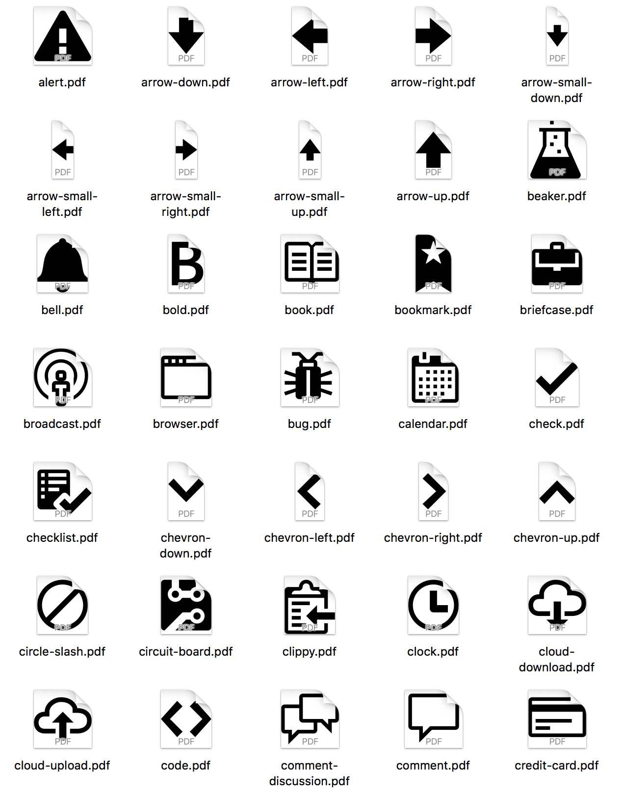

# XCAssets

A prepackaged xcasset catalog containing PDFs of all of the icons from [GitHub's Octicons library](https://github.com/primer/octicons/) and Dave Gandy's [Font Awesome library](http://fontawesome.io).

## Command

PDFs are generated using this shell command:

```
for f in *.svg ; do svg2pdf --width=256 --height=256 $f ${f%%.*}.pdf ; done
```

## Font Awesome 4.7.0

This repository contains an XCAsset catalog that contains PDF versions of the Octicons library. Your usage of the XCAsset catalog is dependent upon your acceptance of Font Awesome's license requirements.


### License

Font Awesome licensed under SIL OFL 1.1 · Code licensed under MIT License · Documentation licensed under CC BY 3.0

## Octicons 5.0.1

This repository contains an XCAsset catalog that contains PDF versions of the Octicons library. Your usage of the XCAsset catalog is dependent upon your acceptance of GitHub's license requirements.



### License

(c) GitHub, Inc.

When using the GitHub logos, be sure to follow the GitHub logo guidelines.